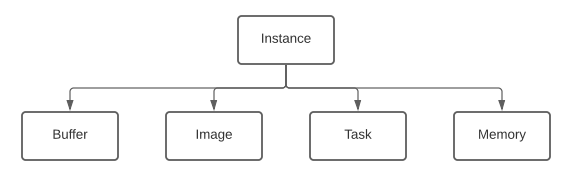
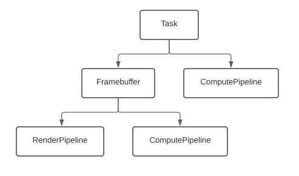
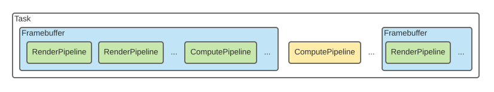
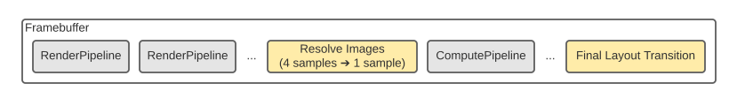
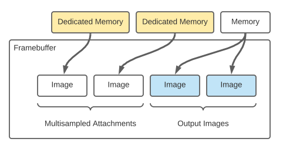
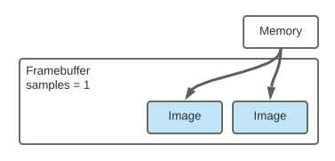

glnext
======

.. code::

    pip install glnext

- `Documentation <https://glnext.readthedocs.io/>`_
- `glnext on Github <https://github.com/glnext/glnext/>`_
- `glnext on PyPI <https://pypi.org/project/glnext/>`_

Objects
=======

.. py:class:: Instance

| Represents a single Vulkan instance.

.. py:class:: Surface

| Represents a Vulkan compatible window surface and an image source.
| The sole purpose of this object is to allow swapping the image source with :py:attr:`Surface.image`.
| Presentation won't take place until :py:meth:`Instance.present` is called.

.. py:class:: Task

| Represents a collection of Vulkan objects and operations.

.. py:class:: Framebuffer

| Represents an entire Render Pass and Framebuffer.
| Graphics Piplines are created from this object.
| Compute Pipelines created from this object can be used to post process the framebuffer output.
| They run before the final layout transition takes place.

.. py:class:: RenderPipeline

| Represents a single Graphics Pipeline and a single draw call per Framebuffer layer.
| RenderPipelines are automatically executed in their order of creation when :py:meth:`Task.run()` is called.

.. py:class:: ComputePipeline

| Represents a single Compute Pipeline and a single dispatch call.
| ComputePipeline are automatically executed in their order of creation when :py:meth:`Task.run()` is called.

.. py:class:: Group

| Represents a context helper for grouping read and write operations and task runs.
| The command buffer is in recording state during the group is active.
| On ``__exit__`` the command buffer is executed and the output memory views are filled with data.

.. py:class:: Buffer

| Represents a device local buffer objects.

.. py:class:: Image

| Represents a device local image objects.

.. py:class:: Memory

| Represents a Vulkan memory allocation.
| This class is for advanced use only.

Documentation
=============

Instance objects
----------------

.. py:method:: glnext.instance(physical_device:int=0, application_name:str=None, application_version:int=0, engine_name:str=None, engine_version:int=0, backend:str=None, surface:bool=False, layers:list=None, cache:bytes=None, debug:bool=False) -> Instance

.. py:method:: Instance.surface(window: tuple, image: Image) -> Surface

    :param tuple window: The window handle in the (hinstance, hwnd) format for windows and (display, window) format for linux.
    :param Image image: The source image.

.. py:method:: Instance.buffer(type: str, size: int, readable:bool=False, writable:bool=True, memory:Memory=None) -> Buffer

.. py:method:: Instance.image(size:tuple, format:str='4p', levels:int=1, layers:int=1, mode:str='output', memory:Memory=None) -> Image

    :param str format: `formats`_

.. py:method:: Instance.task() -> Task

.. py:method:: Instance.group(buffer:int) -> Group

    :param int buffer: The staging buffer size. The staging buffer must large enough to support all the reads and writes within the buffer.
                       The size of the staging buffer is usually the expected maximum number of transfered bytes within the group.
                       The staging buffer consumes the host memory.

| Prevent submitting small command buffers for each read and write call.
| Wrap multiple operations with this context helper.
| The write operations copy immediately into the staging buffer.
| The read and write operations complete only on ``__exit__``.
| All the operations within a group respect ordering.

More on this at `How glnext groups work? <#>`_

.. py:method:: Instance.present()

| For every surface the source image content is blitted to the acquired swapchain image.
| The invalid swapchains silently destroy for the closed windows.
| The user is not responsible for cleaning up after window recreation, the resources are automatically freed.
| This call may be blocking until vsync.

More on this at `How glnext present works? <#>`_

.. py:method:: Instance.cache() -> bytes

| Returns the pipeline cache content.
| The pipeline cache is always empty if the instance was created with ``cache=None``.
| Initialize the :py:class:`Instance` with ``cache=data`` to enable the pipeline cache.

Reasoning behind the cache parameter and the cache function:

There are two best practices to follow:

1. Have a single pipeline cache.

    | When having a pipeline cache the user is expected to provide its content when creating the instance.
    | This can be done with the following code:

    .. code-block::

        my_pipeline_cache_data = b''
        if os.path.exists('my_pipeline_cache.cache'):
            my_pipeline_cache_data = open('my_pipeline_cache.cache', 'rb').read()

        instance = glnext.instance(cache=my_pipeline_cache_data)

        # ... the program goes here

        open('my_pipeline_cache.cache', 'wb').write(instance.cache())

    | In this example the cache parameter is always ``bytes`` even on the first run.
    | There are better ways to load and store binary data. This example is just a short working example.

2. Have no caching at all.

    | To disable the pipeline cache entirely set the cache to ``None``.
    | An :py:class:`Instance` created with ``cache=None`` will not generate cache on pipeline creation
      and the :py:meth:`Instance.cache` will fail with an error.

Surface objects
---------------

.. py:attribute:: Surface.image
    :type: Image

| A surface source image can be replaced by setting the :py:attr:`Surface.image` attribute to a different image.
| The new image must have the same size and format as the original image.
| Setting the image is a cheap operation.

Task objects
------------

.. py:method:: Task.framebuffer(size:tuple, format:str='4p', samples:int=4, levels:int=1, layers:int=1, depth:bool=True, compute:bool=False, mode:str='output', memory:Memory=None) -> Framebuffer

.. py:method:: Task.compute(compute_shader:bytes, compute_count:tuple, bindings:list, memory:Memory=None) -> ComputePipeline

.. py:method:: Task.run()

| Executes all :py:class:`RenderPipeline` and :py:class:`ComputePipeline` objects derived from this objects.
| This call may be blocking until all the operations finish.

Framebuffer objects
-------------------

.. py:method:: Framebuffer.render(vertex_shader, fragment_shader, task_shader, mesh_shader, vertex_format, instance_format, vertex_count, instance_count, index_count, indirect_count, max_draw_count, vertex_buffer, instance_buffer, index_buffer, indirect_buffer, count_buffer, vertex_buffer_offset, instance_buffer_offset, index_buffer_offset, indirect_buffer_offset, count_buffer_offset, topology, restart_index, short_index, depth_test, depth_write, bindings, memory) -> RenderPipeline

.. py:method:: Framebuffer.compute(compute_shader:bytes, compute_count:tuple, bindings:list, memory:Memory=None) -> ComputePipeline

.. py:method:: Framebuffer.update(clear_values:bytes, clear_depth:float, **kwargs)

RenderPipeline objects
----------------------

.. py:method:: RenderPipeline.update(vertex_count:int, instance_count:int, index_count:int, indirect_count:int, **kwargs)

ComputePipeline objects
-----------------------

.. py:method:: ComputePipeline.update(compute_count:tuple, **kwargs)

Group objects
-------------

.. code-block::

    group = instance.group(buffer=1024)    # Create a group with a staging buffer of 1024 bytes
                                           #
    with group:                            # Begin Command Buffer
        buffer1.write(data1)               # Copy data 1 into the staging buffer
        task1.run()                        # Copy task 1 into the command buffer
        task2.run()                        # Copy task 2 into the command buffer
        buffer2.read()                     # Copy buffer 2 into the staging buffer
                                           # End Command Buffer
    data2 = bytes(group.output[0])         # Copy from the staging buffer to a Python variable

.. py:method:: Group.__enter__()

| Start recording into the main command buffer.
| The following methods will have no immediate effect and will be postponed until ``__exit__``:

- :py:meth:`Buffer.read`
- :py:meth:`Buffer.write`
- :py:meth:`Image.read`
- :py:meth:`Image.write`
- :py:meth:`Task.run`

.. py:method:: Group.__exit__()

| Submit the recorded commands.

Buffer objects
--------------

.. py:method:: Buffer.read() -> bytes

.. py:method:: Buffer.write(data: bytes)

Image objects
-------------

.. py:method:: Image.read() -> bytes

.. py:method:: Image.write(data: bytes)

Memory objects
--------------

Diagrams
========

Object Hierarchy
----------------

On the diagram the **[A] -> [B]** represents *"an instance of B can be created from an instance of A"*.

Task Execution
--------------

| Task execution respects the creation order of the Frambuffers and the Compute Pipelines.
| On the diagram above the yellow ComputePipeline is created from the task.
| The yellow Compute Pipeline executes after the first Framebuffer finishes.
| The green Compute Pipeline and the Render Pipelines are part of the Framebuffers.
| They respect their creation order within the Framebuffer.
| On the task level they respect the Framebuffer creation order.

Framebuffer execution
---------------------

| The Render Pipelines of the Framebuffer execute within the render pass.
| The render pass renders directly into the output image if ``samples = 1``.
| For multisampling the resolve step is responsible for the output image content.
| A Framebuffer created with ``compute = True`` can have Compute Pipelines attached to it.
  The Compute Pipelines of the Framebuffer are considered to be the postprocessing step.
| The Compute Pipelines of the Framebuffer execute after the render pass and resolve step but before the final layout transition.
| If the Framebuffer was created with ``compute = True`` the output image will transition into shader storage optimal first.
  After the Compute Pipelines execute the image is transitioned to respect the Framebuffer mode.

Framebuffer Memory
------------------

| Multisampeld Framebuffers have additional images as the render target.
| This library uses `VK_KHR_dedicated_allocation`_ for the multisampled images of the Framebuffer.
| There is not dedicated allocation at the moment for any other part of the code.

.. _VK_KHR_dedicated_allocation: https://www.khronos.org/registry/vulkan/specs/1.2-extensions/man/html/VK_KHR_dedicated_allocation.html

Formats
=======

+---------+-------------------------------+
| Format  | Vulkan Format                 |
+=========+===============================+
| ``1f``  | VK_FORMAT_R32_SFLOAT          |
+---------+-------------------------------+
| ``2f``  | VK_FORMAT_R32G32_SFLOAT       |
+---------+-------------------------------+
| ``3f``  | VK_FORMAT_R32G32B32_SFLOAT    |
+---------+-------------------------------+
| ``4f``  | VK_FORMAT_R32G32B32A32_SFLOAT |
+---------+-------------------------------+
| ``1h``  | VK_FORMAT_R16_SFLOAT          |
+---------+-------------------------------+
| ``2h``  | VK_FORMAT_R16G16_SFLOAT       |
+---------+-------------------------------+
| ``3h``  | VK_FORMAT_R16G16B16_SFLOAT    |
+---------+-------------------------------+
| ``4h``  | VK_FORMAT_R16G16B16A16_SFLOAT |
+---------+-------------------------------+
| ``1i``  | VK_FORMAT_R32_SINT            |
+---------+-------------------------------+
| ``2i``  | VK_FORMAT_R32G32_SINT         |
+---------+-------------------------------+
| ``3i``  | VK_FORMAT_R32G32B32_SINT      |
+---------+-------------------------------+
| ``4i``  | VK_FORMAT_R32G32B32A32_SINT   |
+---------+-------------------------------+
| ``1u``  | VK_FORMAT_R32_UINT            |
+---------+-------------------------------+
| ``2u``  | VK_FORMAT_R32G32_UINT         |
+---------+-------------------------------+
| ``3u``  | VK_FORMAT_R32G32B32_UINT      |
+---------+-------------------------------+
| ``4u``  | VK_FORMAT_R32G32B32A32_UINT   |
+---------+-------------------------------+
| ``1b``  | VK_FORMAT_R8_UINT             |
+---------+-------------------------------+
| ``2b``  | VK_FORMAT_R8G8_UINT           |
+---------+-------------------------------+
| ``3b``  | VK_FORMAT_R8G8B8_UINT         |
+---------+-------------------------------+
| ``4b``  | VK_FORMAT_R8G8B8A8_UINT       |
+---------+-------------------------------+
| ``1p``  | VK_FORMAT_R8_UNORM            |
+---------+-------------------------------+
| ``2p``  | VK_FORMAT_R8G8_UNORM          |
+---------+-------------------------------+
| ``3p``  | VK_FORMAT_R8G8B8_UNORM        |
+---------+-------------------------------+
| ``4p``  | VK_FORMAT_R8G8B8A8_UNORM      |
+---------+-------------------------------+
| ``1s``  | VK_FORMAT_R8_SRGB             |
+---------+-------------------------------+
| ``2s``  | VK_FORMAT_R8G8_SRGB           |
+---------+-------------------------------+
| ``3s``  | VK_FORMAT_R8G8B8_SRGB         |
+---------+-------------------------------+
| ``4s``  | VK_FORMAT_R8G8B8A8_SRGB       |
+---------+-------------------------------+
| ``1x``  | VK_FORMAT_UNDEFINED           |
+---------+-------------------------------+
| ``2x``  | VK_FORMAT_UNDEFINED           |
+---------+-------------------------------+
| ``3x``  | VK_FORMAT_UNDEFINED           |
+---------+-------------------------------+
| ``4x``  | VK_FORMAT_UNDEFINED           |
+---------+-------------------------------+
| ``8x``  | VK_FORMAT_UNDEFINED           |
+---------+-------------------------------+
| ``12x`` | VK_FORMAT_UNDEFINED           |
+---------+-------------------------------+
| ``16x`` | VK_FORMAT_UNDEFINED           |
+---------+-------------------------------+

Image Formats
-------------

.. code-block::

    '4p'     # 4 pixels
    '4b'     # 4 byes
    '3f'     # 3 floats
    '4h'     # 4 half floats
    '3h'     # 3 half floats, but it is unlikely to be supported (size = 6)
    '3p'     # 3 pixels, but it is unlikely to be supported (size = 3)
    '2f 2f'  # multiple attachments are not supported for images
    '4x'     # padding is not supported for images

.. warning::

    Do not use Image formats with size not divisible by four. Those may be supported on you platform, but not on others.

Framebuffer Formats
-------------------

.. code-block::

    '4p'        # 4 pixels
    '3f'        # 3 floats
    '4h 1f'     # 4 half floats and one float
    '3h 2b'     # 3 half floats and 2 bytes, but it is unlikely to be supported (size = 6 + 2)
    '2f 2f'     # 2 floats and 2 floats
    '2f 4x 2f'  # padding is not supported for framebuffers

.. note::

    | Formats are separated with a single space.
    | For each format an Image is created.
    | All the rules that apply on the Image formats apply per Image in the Framebuffer.

Vertex Formats
--------------

.. code-block::

    '4b'        # 4 bytes
    '3f'        # 3 floats
    '3h 2b'     # 3 half floats and 2 bytes
    '2f 2f'     # 2 floats and 2 floats
    '2f 4x 2f'  # 2 floats, 4 bytes padding and 2 floats
    '2f 1b'     # 2 floats and 1 byte

Matrix Vertex Input
-------------------

| To bind matrix vertex attributes use multiple vertex formats as they were separate attributes.

.. code-block:: glsl

    #version 450

    in layout (location = 0) in vec3 position;
    in layout (location = 1) in mat3 rotation;
    in layout (location = 4) in vec3 scale;

| In the example  above ``mat3 rotation`` consumes 3 attribute locations.
| Its vertex format can be defined as ``3f 3f 3f``.

Examples and Patterns
=====================

.. toctree::
   :maxdepth: 2
   :caption: Contents:

Indices and tables
==================

* :ref:`genindex`
* :ref:`modindex`
* :ref:`search`
